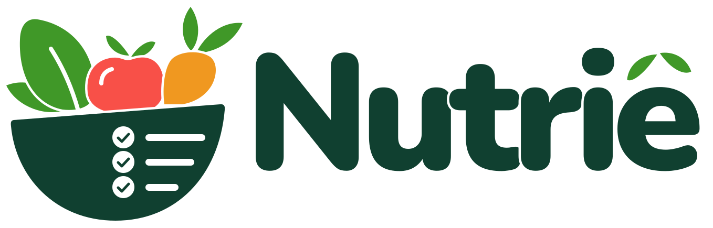

# Nutriê



Web app (PWA) para acompanhar no dia a dia o plano alimentar e a ingestão de água. Ver o
briefing completo em [`refs/BRIEFING_app_plano_alimentar.md`](refs/BRIEFING_app_plano_alimentar.md).

Stack: React + Vite + TypeScript, hospedado no GitHub Pages, com Supabase (Auth + Postgres)
no plano gratuito. Sem backend próprio, sem custo.

Paleta de cores, logo e convenções visuais: ver [`ds.md`](ds.md).

## Desenvolvimento local

```bash
npm install
cp .env.example .env.local   # preencha com os dados do SEU projeto Supabase
npm run dev
```

## Passo a passo para colocar no ar (Thiago)

### 1. Criar o projeto no Supabase

1. Acesse [supabase.com](https://supabase.com), crie uma conta gratuita e um novo projeto
   (plano **Free**, sem cartão de crédito).
2. Em **Project Settings → API**, copie a **Project URL** e a **anon public key**. Você vai
   usar essas duas informações nos passos 3 e 4.

### 2. Rodar as migrations (criar as tabelas)

1. No painel do Supabase, abra **SQL Editor → New query**.
2. Para cada arquivo de [`supabase/migrations/`](supabase/migrations/), **em ordem de nome**
   (a data no começo do nome), copie todo o conteúdo, cole no SQL Editor e clique em **Run**.

(No projeto atual isso já foi feito pelo Claude Code via MCP do Supabase; este passo vale para
recriar o projeto do zero.)

### 3. Liberar seu e-mail (e o de uma conta de teste) para criar conta

O cadastro é só para convidados: sem isso, ninguém consegue entrar, nem você.

1. Copie [`supabase/seed/allowed_emails.example.sql`](supabase/seed/allowed_emails.example.sql)
   para um novo arquivo `supabase/seed/allowed_emails.local.sql` (esse nome fica **fora do
   Git**, não vaza nenhum e-mail no repositório público).
2. Edite o arquivo novo trocando os e-mails de exemplo pelo seu e pelo da conta de teste.
3. Cole o conteúdo no **SQL Editor** do Supabase e clique em **Run**.
4. Pode rodar de novo sempre que quiser liberar mais um e-mail.

### 4. Ativar o login com Google

1. No [Google Cloud Console](https://console.cloud.google.com/), crie um projeto (ou use um
   existente) e vá em **APIs & Services → Credentials → Create Credentials → OAuth client
   ID → Web application**.
2. No Supabase, vá em **Authentication → Sign In / Providers → Google** para ver a **Callback
   URL (for OAuth)** exigida — cole essa URL em **Authorized redirect URIs** no Google Cloud.
3. Volte ao Google Cloud, copie o **Client ID** e o **Client Secret** gerados.
4. No Supabase, cole o Client ID e o Client Secret na mesma tela do provedor Google e salve.

### 5. Configurar e-mail/senha (sem exigir confirmação por e-mail)

O Supabase Free só envia 2 e-mails por hora pelo provedor embutido. Como o cadastro já é
controlado pela lista de convidados (passo 3), vamos pular a confirmação por e-mail para
evitar esbarrar nesse limite:

1. Em **Authentication → Sign In / Providers → Email**, desligue a opção **Confirm email**.

### 6. Configurar as URLs do app no Supabase

1. Em **Authentication → URL Configuration**:
   - **Site URL**: `https://SEU-USUARIO.github.io/nutri-web-app/`
   - **Redirect URLs**: adicione a mesma URL acima.

   (Troque `SEU-USUARIO` pelo seu usuário do GitHub.)

### 7. Publicar o repositório no GitHub

Isso é feito junto comigo, pedindo sua confirmação antes de criar algo público na sua conta.

### 8. Ativar o GitHub Pages e configurar o build

No repositório, no GitHub:

1. **Settings → Pages → Source**: escolha **GitHub Actions**.
2. **Settings → Secrets and variables → Actions → Variables tab → New repository variable**,
   crie duas (são públicas por natureza, protegidas pelo Row Level Security, por isso vão
   como "Variables" e não "Secrets"):
   - `VITE_SUPABASE_URL` = a Project URL do passo 1.
   - `VITE_SUPABASE_ANON_KEY` = a anon public key do passo 1.
3. Dê um push na branch `main` (ou rode o workflow manualmente em **Actions**). Depois que a
   Action terminar (ícone verde), o app estará em `https://SEU-USUARIO.github.io/nutri-web-app/`.

### 9. Carregar o seu plano (seed)

Depois do primeiro login da sua conta, rode no **SQL Editor** o arquivo
`supabase/seed/plan_<nome>.local.sql` (fica **fora do Git**: tem dado de saúde e e-mail). Ele
pode ser rodado de novo: desativa o plano anterior e cria um novo ativo.

## O que já funciona

- Login com Google e com e-mail/senha, restrito a e-mails convidados.
- No celular, convite para instalar o app (primeira tela) e faixa lembrando de instalar
  enquanto o app estiver aberto no navegador.
- Tema claro/escuro seguindo o sistema, com botão para inverter.
- Tela "Hoje": refeições do dia em ordem de horário, a próxima em destaque, alimentos,
  quantidades e trocas; aviso do plano; meta de água e próximo horário do protocolo; soma das
  refeições ao lado da meta do plano (sem "corrigir" nenhuma); observações.
- Novo plano (menu ☰ ou tela Hoje vazia), em camadas:
  1. o celular lê o PDF sem IA e sem enviá-lo (pdf.js + interpretador em
     `src/lib/planParser.ts`, com testes em `npm test`);
  2. se a leitura ficar fraca, quem é VIP pode ler com IA (Claude, via Edge Function
     `ai-extract-plan`, com teto mensal por usuário e registro de custo);
  3. sempre dá para montar à mão. Tudo cai na mesma tela de revisão antes de salvar.
- Marcar refeição como feita com um toque na tela Hoje (e desmarcar), indicando a troca usada
  em cada alimento; contador "X de N registradas"; o destaque pula as refeições já registradas. O dia
  é o do fuso do usuário (testes em `src/lib/plan.test.ts`).
- "Comi outra coisa" em cada refeição: escolhe da lista pessoal "Já comi antes" (sem IA),
  estima calorias e macros com IA (VIP) ou digita à mão; o que é novo entra na lista. O
  resumo do dia mostra o que foi comido nas refeições marcadas (plano + fora do plano).
- "Comeu fora de hora?" na tela Hoje, antes da água: descreve o que comeu fora das refeições
  (busca o que já registrou, estima com IA ou preenche à mão) e isso soma no total do dia.
- Água na tela Hoje: progresso contra a meta do plano, botões de um toque (200/500 mL e o
  volume do protocolo) e "Outro", horários do plano como guia e registros do dia com
  "Apagar" (regras testadas em `src/lib/water.test.ts`).
- Meu plano (menu ☰): resumo do plano atual, **editar com IA** por texto livre (VIP; a IA
  aplica só o pedido e lista o que mudou), editar à mão no mesmo editor, ou enviar um plano
  novo. Cada salvamento cria uma versão nova (a anterior fica guardada) e as refeições já
  marcadas hoje passam para a versão nova.
- Barra de navegação embaixo: Refeições, Água e Resumo (rolam a tela Hoje) e Estatísticas.
- Estatísticas (barra de baixo ou menu ☰): dia, semana e mês, com refeições registradas, água contra
  a meta e calorias registradas contra o total do plano, em gráficos por dia; sequência de dias
  completos e selo de parabéns para compartilhar (só a conquista, nada do plano). Regras
  testadas em `src/lib/stats.test.ts`.
- Selo "beta v1.0.N" no cabeçalho: N é o número do deploy, para conferir a versão em produção.
- Cabeçalho com menu da conta: "Minha conta" (nome para a saudação, fuso horário, definir ou
  trocar senha) e "Sair".
- Deploy automático para o GitHub Pages a cada push na `main`.
- Notificações: aviso na tela Hoje e cartão em "Minha conta" para ativar neste aparelho (permissão
  pedida no toque). Web Push com chaves VAPID geradas pela Edge Function `push` e guardadas
  no Vault; o agendamento do banco (`pg_cron` + `pg_net`) chama a função a cada minuto, que envia o
  que venceu e apaga inscrições expiradas. Inscrições em `push_subscriptions`, testes em `push_tests`.

## O que ainda não existe (próximas fatias)

Lembretes de refeição e de água (em cima da prova de notificações), pessoas da casa, lista de
compras e apagar a conta pelo app — na ordem do briefing, seção 11.

## IA (só VIP)

- Quem é VIP: tabela `ai_access` (o app só lê). Para liberar alguém, no SQL Editor:
  `insert into ai_access (user_id, monthly_limit_usd) select id, 1.00 from auth.users where email = '...';`
- Segredos em **Edge Functions → Secrets**: `ANTHROPIC_API_KEY` (obrigatório), `AI_MODEL`
  (opcional, padrão `claude-opus-5-5`) e `AI_EFFORT` (opcional, padrão `low`).
- Gasto por usuário e por chamada: tabela `ai_usage`.

## Teste de isolamento entre usuários

[`supabase/tests/rls_isolation.sql`](supabase/tests/rls_isolation.sql) confere que um usuário
não lê nem altera nada de outro. Rode no SQL Editor depois de qualquer migration; ele desfaz
tudo o que cria e mostra o resultado na mensagem de erro proposital no final.

## Observações importantes

- O repositório é **público**: nenhum dado pessoal (e-mail, plano alimentar) pode ser
  commitado. Os arquivos `*.local.sql` e `.env.local` ficam fora do Git por isso.
- Se o projeto do Supabase ficar uma semana sem uso, ele é pausado automaticamente (plano
  Free). Com uso diário isso não deve acontecer; se acontecer, o app mostra uma mensagem
  clara em vez de travar.
